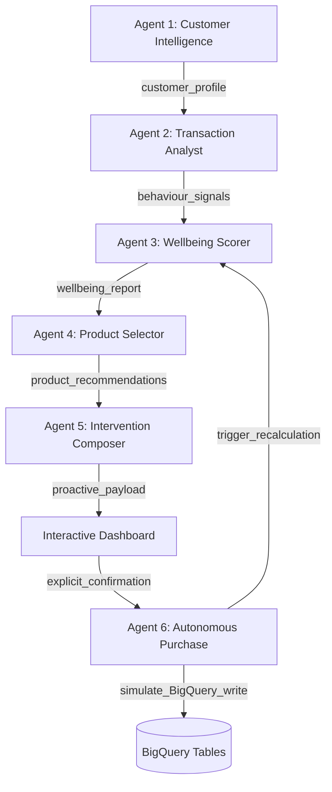

# 🟢 Lloyds Financial Wellbeing AI v2 — EDB Hackathon Platform

Welcome to the **Lloyds Financial Wellbeing AI (v2)** project directory. This high-fidelity, premium interactive prototype simulates a complete 6-Agent proactive orchestration pipeline powered by Google ADK + Gemini, integrated with a synthetic 500+ customer BigQuery database.

---

## 🚀 How to Run the Live Dashboard

You can start a local server instantly and launch the dashboard in your default browser.

### Option 1: Fast Launch (PowerShell)
Run this command in your terminal to start a local server on port `8000`:
```powershell
Start-Process "http://localhost:8000" && python -m http.server 8000 --directory "C:\Users\shpav\lloyds-wellbeing-ai"
```

### Option 2: Direct File Execution
Since this is a client-side Single Page Application (SPA) designed with Vanilla JS and CSS, you can open `index.html` directly in any browser:
* Double-click the file: [index.html](file:///C:/Users/shpav/lloyds-wellbeing-ai/index.html)

---

## 📐 Architecture & 6-Agent Handoff Pipeline

The system is organized into **6 modular agents**, passing state dynamically in real-time. You can watch this flow live in the **Agent Activity Log Console** on the right side of the dashboard:



### The 6 Agents Explained:
1. **Agent 1: Customer Intelligence Agent**: Classifies tier (`NORMAL` vs `PRIVILEGED`) on-load based on salary credits averaged over 3 months, checks Premier eligibility (`balance >= £100k` or `deposit >= £5k/mo`), and calculates credit utilisation.
2. **Agent 2: Transaction Analyst Agent**: Computes category spending, month-on-month savings changes, essential vs. discretionary spending ratios, overdraft events, and income stability.
3. **Agent 3: Wellbeing Scorer Agent**: Computes score (0–100) across 4 core dimensions (25 pts each) and classifies the customer into `GREEN` (80–100), `AMBER` (50–79), or `RED` (0–49).
4. **Agent 4: Product Selector Agent**: Queries live rates and selects the top 1-2 product matches for the specific tier and wellbeing band (such as the market-leading **Club Lloyds Monthly Saver @ 6.25% AER**).
5. **Agent 5: Intervention Agent**: Composes a highly personalized, proactive banner (warm/practical for `NORMAL`, professional/data-led for `PRIVILEGED`).
6. **Agent 6: Purchase Agent**: Autonomous fulfillment. Once the user clicks "Confirm", Agent 6 verifies current checking balance, executes a mock BigQuery debit write, creates the product account, triggers score recalculation, and pushes a success banner.

---

## 📊 Live BigQuery Simulation Sandbox

The dashboard features a live, spreadsheet-like database viewer at the bottom. The simulation comprises:
* **`customers`**: 500+ records programmatically initialized.
* **`accounts`**: Checking, savings, credit cards, and ISAs mapped to customers.
* **`transactions`**: High-fidelity transaction ledger (salary deposits, bills, groceries, leisure, dining) covering 6 months.
* **`products_live`**: Grounded bank rates (6.25% AER Monthly Savers, 4.40% Fixed Bonds, etc.) refreshed dynamically.
* **`banners`**: Real-time event-driven alerts.

---

## 🎬 Demo Scenarios to Try:

1. **Marcus Sterling (`CUST_0042`) — NORMAL TIER + RED WELLBEING**
   * **Attributes**: Income £28k, overdraft 2x, missed utility direct debit, savings depleted (£0).
   * **Behavior**: Dashboard alerts are urgent. Banners recommend the **Standard Saver** (easy-access, £1 min) to escape overdraft leakage. Click "Open Account" to deposit and watch his score rise!
2. **Victoria Hargreaves (`CUST_0099`) — PRIVILEGED TIER + GREEN WELLBEING**
   * **Attributes**: Income £95k, total balance over £57k (underinvested cash), no active ISA.
   * **Behavior**: Professional, data-driven layout. Recommends **Ready-Made Investments Adventurous** to beat cash inflation.
3. **Julian Finch (`CUST_0150`) — PRIVILEGED TIER + RED WELLBEING**
   * **Attributes**: Income £110k, overdrawn checking, £9.5k credit card debt.
   * **Behavior**: Focuses on emergency debt restructuring plans.
