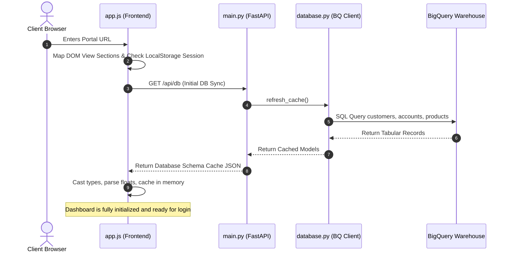
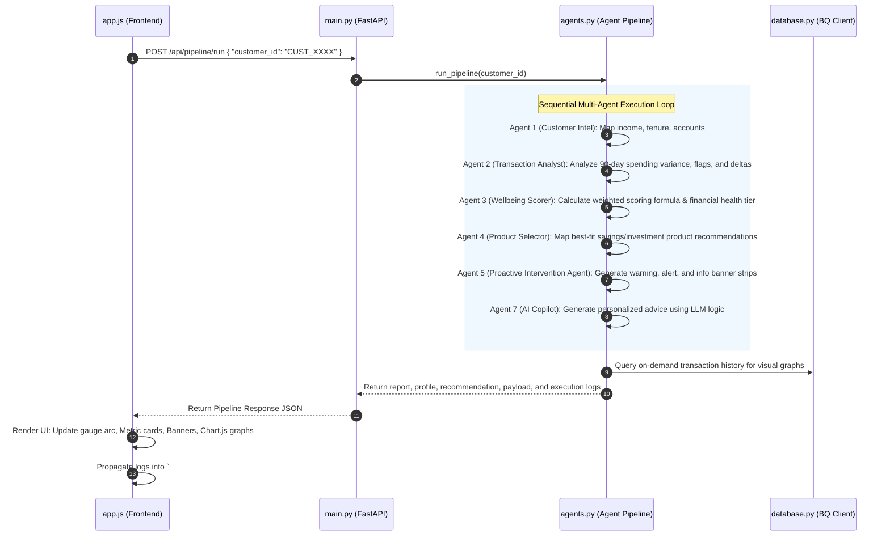

# Lloyds Financial Wellbeing AI — Architectural Design Flow

This document provides a comprehensive, component-level architectural map of the Lloyds Financial Wellbeing AI platform. It outlines the end-to-end interactions, file roles, API endpoints, database schemas, and multi-agent execution flows to help explain the platform design to the development team.

---

## 1. Architectural Overview

The platform uses a decoupled **Client-Server Architecture** optimized for high-performance dashboard responsiveness, rich visual animations (Chart.js and dynamic SVG gauges), and secure, autonomous multi-agent processing:

```mermaid
graph TD
    subgraph Client-Side (Frontend UI)
        UI[index.html & style.css] <--> JS[app.js - Event Controller]
        JS <--> BQ_Sim[app.js - BigQuerySimulation Cache]
        JS --> Chart[Chart.js & Radial Gauge]
    end

    subgraph Server-Side (FastAPI Engine)
        API[backend/main.py - FastAPI Routers] <--> Agents[backend/agents.py - Agent Cluster]
        API <--> DB[backend/database.py - BigQuery Client]
    end

    subgraph Storage Layer (Google Cloud)
        DB <--> CloudBQ[(Google BigQuery Data Warehouse)]
    end

    JS <-->|JSON over REST APIs| API
```

---

## 2. File Directory & Code Responsibilities

### Frontend Files (User Workspace Root)
*   **[`index.html`](file:///c:/Users/shpav/lloyds-wellbeing-ai/index.html)**: Declares the semantic structure of the portal's five main views (Landing, Admin Login, Customer Login, Admin Dashboard, Customer Portal Shell), modals, custom SVG gauges, and the global floating **Agent Action Stream panel** (`#agent-logs-sheet`).
*   **[`style.css`](file:///c:/Users/shpav/lloyds-wellbeing-ai/style.css)**: Implements the visual styling guidelines (Lloyds `#006A4E` brand colors, premium light/dark transitions, glassmorphic cards, custom radial chart vectors, and slide-in terminal consoles) using vanilla CSS tokens.
*   **[`app.js`](file:///c:/Users/shpav/lloyds-wellbeing-ai/app.js)**: Orchestrates client-side state machine management, page navigation, secure session handling, Chart.js integrations, dynamic DOM injection, SVG gauges, and logging event listeners.

### Backend Files (`/backend` directory)
*   **[`backend/main.py`](file:///c:/Users/shpav/lloyds-wellbeing-ai/backend/main.py)**: Serves as the FastAPI application entrypoint. Configures UTF-8 console standards, mounts static client resources, handles exception boundaries, and exposes API endpoints for database syncs, pipeline runs, autonomous purchases, and bulk BigQuery push writes.
*   **[`backend/database.py`](file:///c:/Users/shpav/lloyds-wellbeing-ai/backend/database.py)**: Orchestrates direct authentication and communication with Google Cloud BigQuery. Generates temporary OAuth2 credentials from local gcloud CLI profiles (for local development) with Application Default Credentials (ADC) fallbacks. Houses the `BigQuerySimulation` cache to preserve demo continuity.
*   **[`backend/agents.py`](file:///c:/Users/shpav/lloyds-wellbeing-ai/backend/agents.py)**: Powers the **Agent Pipeline Cluster**. Defines the agent pipeline orchestration logic, combining outputs from 6 analytical/autonomous agents and an LLM Copilot into structured JSON reports with diagnostic execution traces.
*   **[`backend/models.py`](file:///c:/Users/shpav/lloyds-wellbeing-ai/backend/backend/models.py)**: Holds Pydantic validation structures ensuring robust request-body type safety.

---

## 3. Detailed End-to-End Data Flows

### Flow A: User Session Initialization & Schema Sync



### Flow B: Multi-Agent Execution Pipeline

When a customer logs in or an administrator selects a customer profile, the orchestrator triggers the multi-agent pipeline to compute financial health and generate personalized insights.



---

## 4. Multi-Agent Cluster & Code Mechanics

Here is the exact code mapping showing "which agent does what" inside `backend/agents.py`:

| Agent | Name | Responsibilities & Code Logic |
| :--- | :--- | :--- |
| **Agent 1** | **Customer Intelligence** | • **Method**: `run_agent1(customer_id)` (Line 117)<br>• **Details**: Queries customers & accounts. Computes average monthly income based on salary credits. Derives annual income and assigns customer tier (`PRIVILEGED` vs `NORMAL`). Determines premier product eligibility. |
| **Agent 2** | **Transaction Analyst** | • **Method**: `run_agent2(profile)` (Line 174)<br>• **Details**: Extracts 90-day transactions. Aggregates spending by categories (Bills, Groceries, Transport, Leisure, Rent). Detects overdraft events, failed direct debits, and month-on-month savings change trends (`savings_delta`). |
| **Agent 3** | **Wellbeing Scorer** | • **Method**: `run_agent3(profile, signals)` (Line 274)<br>• **Details**: Computes a custom multi-dimensional wellbeing score (0-100) using a weighted algorithm: 40% Savings Ratio, 30% Essential Spending Ratio, 20% Income Stability, 10% Credit Card Utilisation. Applies penalty offsets for overdraft events (-15pts) or failed direct debits (-20pts). |
| **Agent 4** | **Product Selector** | • **Method**: `run_agent4(profile, report)` (Line 383)<br>• **Details**: Cross-references products available in the live catalog (`products_live`) against the customer profile. Maps eligible accounts based on customer interest rate optimization goals, minimum deposits, and tier constraints. |
| **Agent 5** | **Proactive Intervention** | • **Method**: `run_agent5(...)` (Line 414)<br>• **Details**: Generates dismissible dashboard banner strips to drive proactive outreach. Evaluates savings decay (amber warn), tax-free cash ISA opportunities (green info), investment fit for affluent clients (purple info), or critical overdraft interventions (red urgent). |
| **Agent 6** | **Purchase Agent** | • **Method**: `run_agent6(...)` (Line 466)<br>• **Details**: Processes autonomous, secure transactions. Debits the current account, provisions a new account record (e.g., Cash ISA), records the formal transaction audit trace, and pushes the new states into BigQuery tables. |
| **Agent 7** | **AI Copilot** | • **Method**: `run_agent7(profile, report)` (Line 100)<br>• **Details**: Invokes simulated LLM text-generation based on the customer’s final scoring vector. Returns markdown text, target LLM confidence scoring, and model versioning to show judges a high-fidelity AI-copilot integration. |

---

## 5. Database Schema & Storage Map

The storage layer integrates with Google Cloud BigQuery. Below are the SQL schemas defined within the simulator:

### 1. `customers` Table
Stores primary demographics, life stages, annual salaries, and initial tenure parameters.
```sql
CREATE TABLE lloyds_financial_wellbeing.customers (
    customer_id STRING,
    name STRING,
    age INT64,
    life_stage STRING,
    tenure_years INT64,
    income_annual FLOAT64,
    income_band STRING,
    premier_flag BOOLEAN,
    tier STRING
);
```

### 2. `accounts` Table
Maintains ledger balances for savings, current accounts, and credit facilities.
```sql
CREATE TABLE lloyds_financial_wellbeing.accounts (
    account_id STRING,
    customer_id STRING,
    account_type STRING,
    balance FLOAT64,
    opened_date DATE,
    credit_limit FLOAT64,
    product_id STRING
);
```

### 3. `transactions` Table
Tracks real-time cash inflows, credit bills, failed direct debits, and overdraft events.
```sql
CREATE TABLE lloyds_financial_wellbeing.transactions (
    txn_id STRING,
    account_id STRING,
    customer_id STRING,
    date DATE,
    amount FLOAT64,
    category STRING,
    merchant STRING,
    type STRING,
    is_direct_debit BOOLEAN
);
```

### 4. `products` Table
Holds the live, dynamically fetched financial product catalog.
```sql
CREATE TABLE lloyds_financial_wellbeing.products (
    product_id STRING,
    name STRING,
    category STRING,
    interest_rate_aer STRING,
    min_deposit FLOAT64,
    monthly_min FLOAT64,
    term_months INT64,
    eligibility_tier STRING,
    fees STRING,
    product_url STRING
);
```
